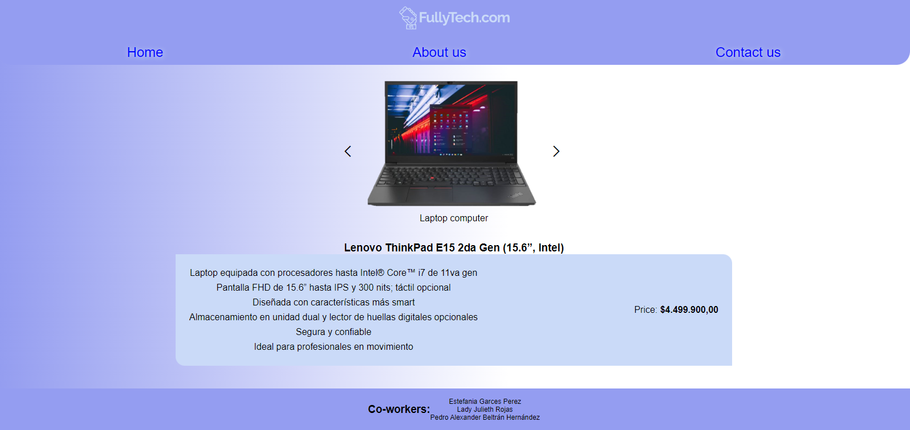

# AP06-AA7-EV03. DISEÑO Y DESARROLLO DE LA INTERFAZ WEB DEL PROYECTO EN CURSO.

___presentado por:___

* Estefania Garces Perez
* Lady Julieth Rojas
* Pedro Alexander Beltran Hernandez

Buen día a todos, compartimos lo que seria el prototipo inicial de nuestro proyecto el cual consiste en realizar un aplicativo de e-commerce para dispositivos tecnologicos. Compartimos una imagen de la maquetacion y dejamos adjunto en este proyecto el codigo fuente para ejecturase. Este proyecto esta desarrollado con HTML, CSS y JavaScript.

